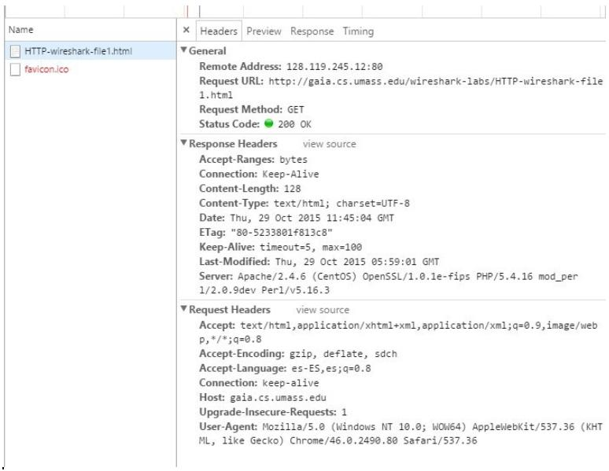

# Protocolo HTTP

Introduzca la siguiente dirección en la barra de direcciones de su navegador: 

http://gaia.cs.umass.edu/wireshark-labs/HTTP-wireshark-file1.html 

Con el navegador Chrome aparecerá una pantalla como la siguiente. Aparecen información tanto de la petición http como de la respuesta. 

Realiza una memoria analizando la información de los mensajes HTTP de petición y respuesta y conteste las preguntas que se plantean. En la respuesta a las preguntas debe indicar las porciones de los mensajes de petición y respuesta en las que basa su contestación: 
1. ¿Qué versión de HTTP emplea su navegador? ¿Qué versión de HTTP ejecuta el servidor? 
1. ¿Qué idiomas indica su navegador al servidor que está dispuesto aceptar en la respuesta? 
1. ¿Cuál es la dirección IP de su ordenador? ¿Y del servidor web al que está accediendo? 
1. ¿Cuál es el código de estado devuelto a su navegador por el servidor? ¿Cuál es el significado de ese código de estado? 
1. ¿Cuándo fue modificado por última vez el fichero HTML que el servidor te está devolviendo? 